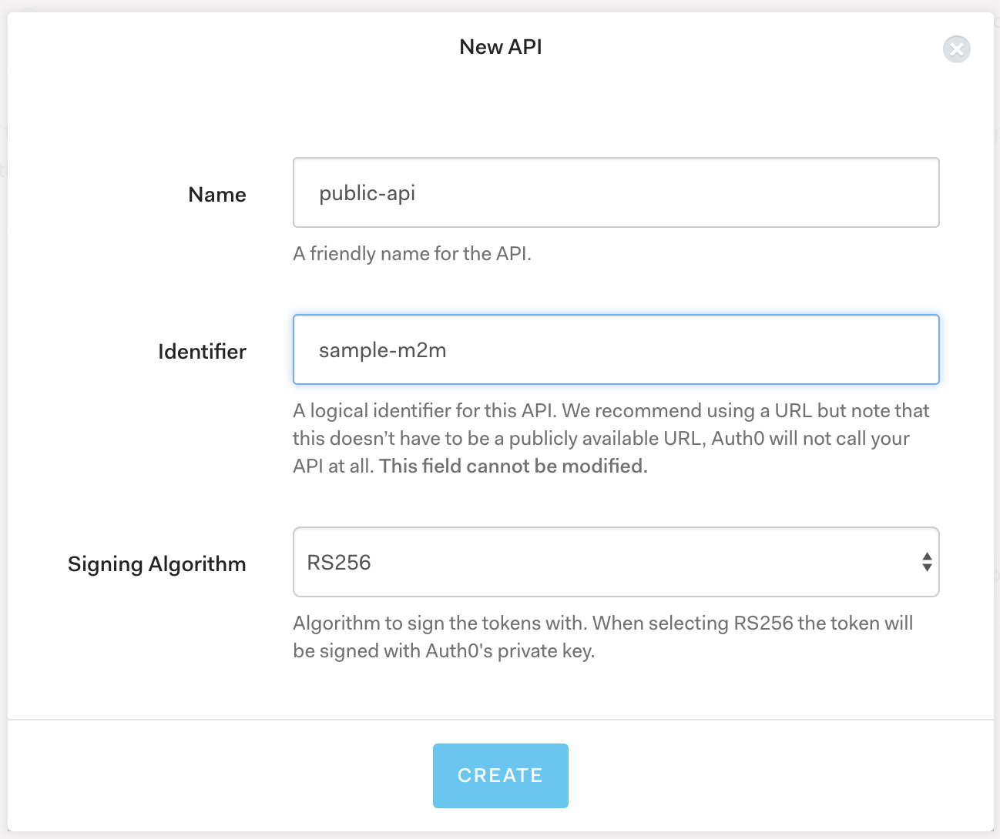
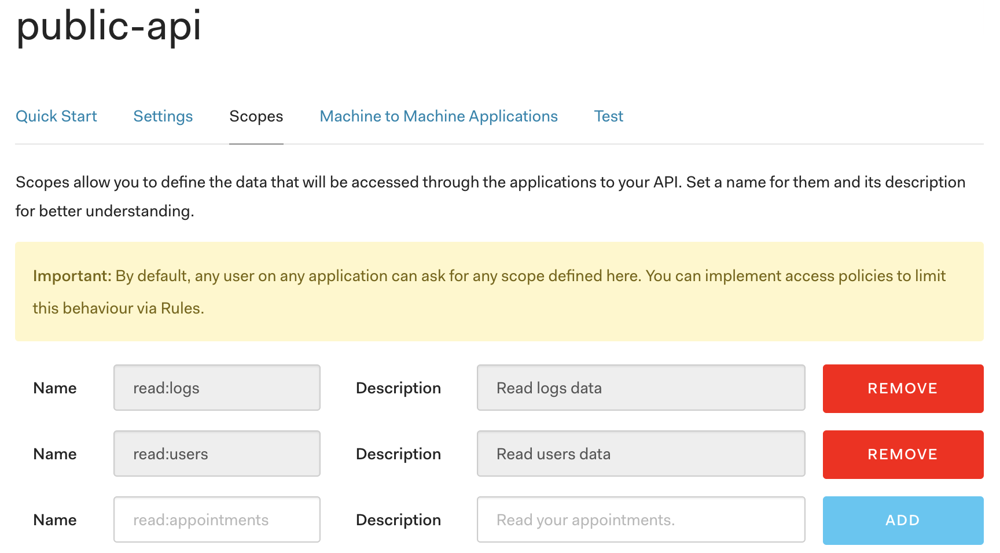
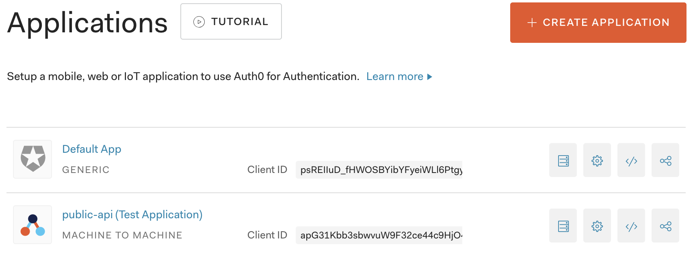
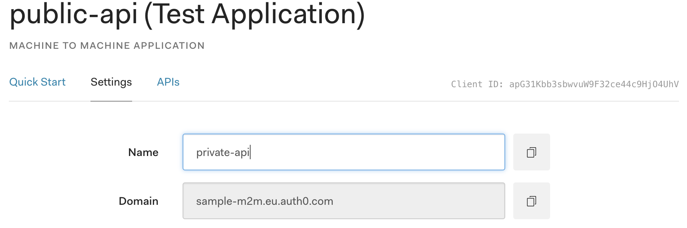
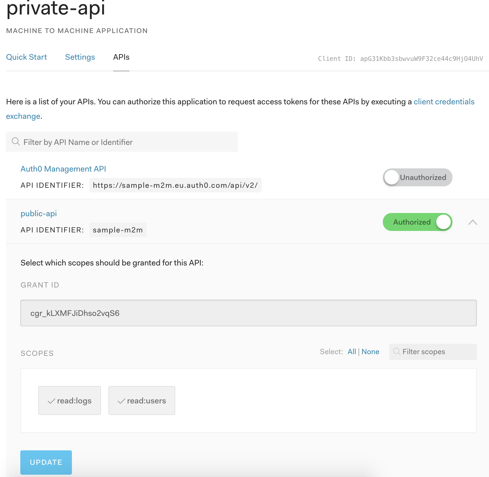
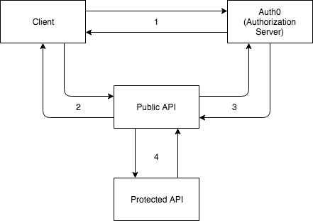

# sample-m2m
This repository provides a sample for a [Auth0](https://auth0.com/) *[Machine to Machine](https://auth0.com/docs/applications/machine-to-machine)* application.
The repository contains 2 different servers:
* [public-api](#auth0-api): This API will be accessible from *outside*. Some endpoints are protected with valid tokens.
* [protected-api](#auth0-app): This API is private, protected with a machine to machine valid token.

## Requirements
* node and npm
* [Auth0 account](https://auth0.com/signup)

## Setup
We have to go to [Auth0 Dashboard](https://manage.auth0.com/) and create:
* API
* Application

### Autho Dashboard

For our sample project we have visit the [dashboard](https://manage.auth0.com/) and:
1. First we create an API, where we have to set up the *name* and the *Identifier* that we will use as **audience** to validate the token. \

This creates an API and also a machine to machine application.
2. Once we have create the API, we go to the details section on our API, and we go to **Scopes** tab. \
There we can add different scopes that our API will have to access the application. In our case we add 2 scopes

3. We go to **[Applications](https://manage.auth0.com/#/applications)** section and we can see all our applications\
.
Then we click on the test app created with the API, or we can create a new application.
If we want to use the test app, we can rename it, in this case we changed it *private-api*

4. If we want to add scopes to the token, we visit the *APIs* tab in our application, and select the desired api, in our case *public-api*, then we click on it and select the scopes we want to add to the API to restric access to some endpoint of our *Private API* 


### Auth0 API
To setup the Public API, we need to create an [Auth0 API](https://manage.auth0.com/#/apis).\
Check this [post](https://auth0.com/docs/quickstart/backend/nodejs) to see how to create an API for nodejs.\
After you create an API, a test application will be created, you can use that app or create a new one.

When we have created the API, we have to setup the *.env* file on the folder **public-api**.\
Once you have setup the .env file, run the server ```npm start```

### Auth0 APP
To setup the Private API, we need to create an [Auth0 Application](https://manage.auth0.com/#/applications), in this case, we need to create a **[machine to machine](https://auth0.com/docs/applications/machine-to-machine)** application.\

Then we have to setup the *.env* file on the folder **private-api**.\
Once you have setup the .env file, run the server ```npm start```

### Client
We have protected the public API with a [jwt token](https://auth0.com/docs/jwt), in this case we are going to use Auth0 tokens from our account, so we need an application that authenticate the users with Auth0. You can check this [repo](https://github.com/jmn8718/auth0-spa) on how to set up a SPA application to connect with Auth0.\
When the user authenticates in our SPA, we can connect to the Public API with the token obtained from Auth0.

## Architecture
You can see the architecture of the system in the diagram



1. A client authenticate with Auth0 services, and it receives an access token that can be used to access the protected endpoints of the public API.
2. With the access token, the client send the request to the public API server, that will validate and check the user in order to access the protected endpoints.
3. The public API authenticate with the Auth0 server to get a token to connect to the Protected API.
4. The public API send authenticated request to the protected API in order to access some resources. This connection is secured and no user/client is involved, this is the machine to machine connection.

### Public API
The public API exposes:
* **/**: It is a public endpoint, that returns a json object.
* **/protected**: It is a protected endpoint, it will request to */protected* of the private api.
* **/users**: It is a protected endpoint, it will request to */users* of the private api.
* **/logs**: It is a protected endpoint, it will request to */logs* of the private api.
* **/apis**: It is a protected endpoint, it will request to */apis* of the private api.

### Protected API
The protected API exposes different endpoints:
* **/protected**: It is a protected endpoint, it will request to */protected* of the private api.
* **/users**, **/logs**, **/apis**: They are protected endpoints, they required a valid token and also require the token to have the right scope to access, in this sample project, they require *read:XYZ(service name)*.
As we have set up the Public API with *read:users* and *read:logs* scopes, the Public API can only access to ***/users** and **/logs** because **/apis** requires *read:apis* and the Public API do not have this scope, so when the public API tries to access this resource, it gets a **401** response.
